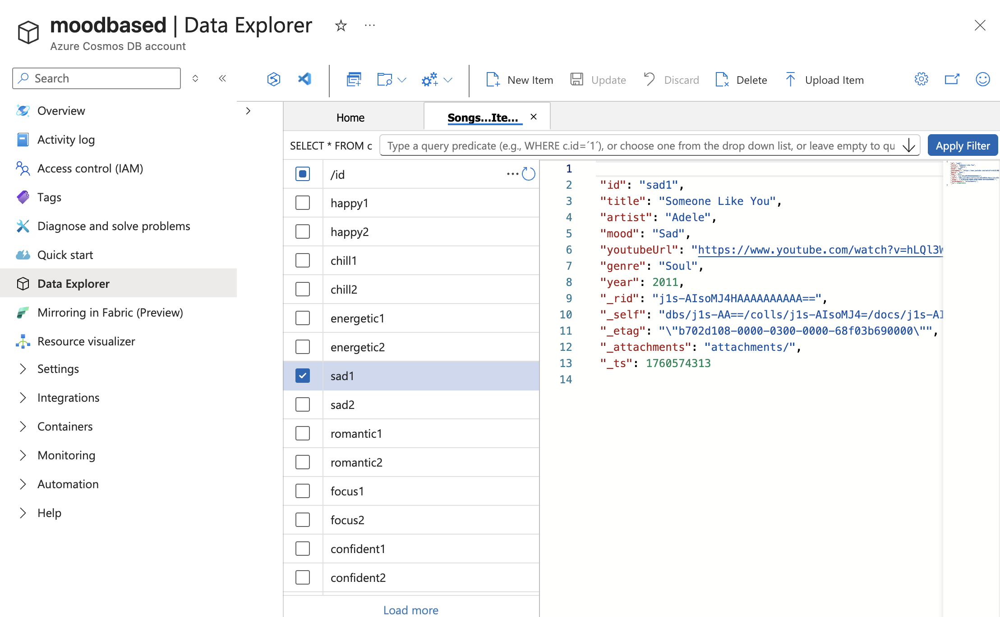

🎧 Mood-Based Song Recommender – Project Summary

I started this project by uploading my index.html file to Azure Static Web Apps through GitHub, which hosted my frontend automatically.

After setting up the static app, I created several Azure resources to bring the backend and database together:

Azure Cosmos DB – I created a NoSQL database named MoodRecommenderDB with a Songs container to store song data (title, artist, mood, genre, and YouTube URL).

Azure Function App – I built a Python function called GetRecommendations that connected to Cosmos DB and returned songs based on the mood sent from the frontend.

Azure Function Configuration – I added environment variables for my Cosmos DB endpoint, key, database name, and container name to keep the connection secure.

Azure Static Web App (API Link) – I linked my existing Function App to the Static Web App under the APIs section so all /api/ requests from the frontend routed directly to my function.

GitHub Repository – I used GitHub to store my frontend and backend code, and Azure automatically deployed updates through a GitHub Actions workflow.

By the end, the Static Web App, Function App, and Cosmos DB worked together:
when a user selected a mood on the website, the app retrieved matching songs from Cosmos DB and displayed them instantly.
